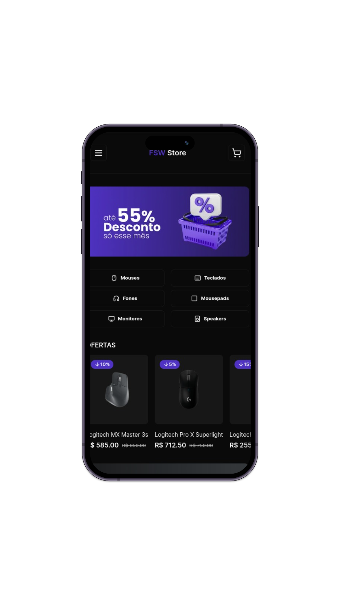

<p>Este projeto foi desenvolvimento durante a FSW - Fullstack week.</p>

<h1 align="center">
  Fullstack - Store
    
</h1>

## 💻 Projeto
Nessa aplicação foi desenvolvido um E-commerce fullstack com Next.js e muitas outras tecnologias atuais de mercado. Essa plataforma de comércio eletrônico combina o poder da tecnologia de ponta com uma experiência de compra intuitiva, proporcionando aos usuários uma maneira rápida, segura e agradável de explorar e adquirir produtos.

## Startando o Projeto

Primeiro, execute o servidor:

```bash
npm run dev
# or
yarn dev
# or
pnpm dev
# or
bun dev
```

Abra [http://localhost:3000](http://localhost:3000) no seu navegador para ver o resultado.

## 👉 TECNOLOGIAS

Este aplicação apresenta algumas das mais recentes ferramentas e práticas em desenvolvimento web!!
Alguns deles estão listados abaixo.

### Frontend:
- ⚛️ [ReactJs](https://react.dev/)
- 💹 [Typescript](https://www.typescriptlang.org/)
- ⚛️ [Tailwindcss](https://tailwindcss.com/)
- ⚛️ [Shadcn](https://ui.shadcn.com/)
- ⚛️ [NextAuth.js](https://next-auth.js.org/)

### Backend:
- ⚛️ [NextJs](https://nextjs.org/docs)
- 💹 [Prisma](https://www.prisma.io/)
- 💹 [Supabase](https://supabase.com/)
- 💹 [Stripe](https://stripe.com/en-br)
- 💹 [Diagrams](https://app.diagrams.net/)
- ⚛️ [Vercel](https://vercel.com/new?utm_medium=default-template&filter=next.js&utm_source=create-next-app&utm_campaign=create-next-app-readme) 

## Autor
<a href="#">
 
 <br/>
 <sub><b>Edimilson Braz</b></sub></a>🚀

Feito com ❤️ por Edimilson Braz 👋🏽 Entre em contato!

[](https://www.linkedin.com/in/edimilsonbraz/) 
[](mailto:edimilson.gt8@gmail.com)
